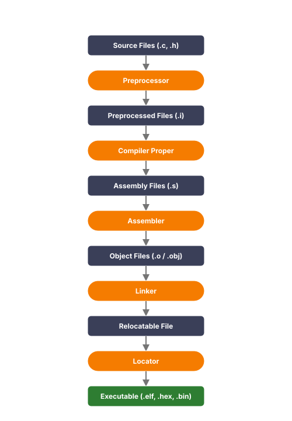

**Compilation and Linking Process**

This document outlines the step-by-step pipeline of translating high-level source files into a target-ready executable.

---

### Pipeline Flow Diagram

---

### Step-by-Step Transition Table

| Input File / Stage | ➔ | Process / Tool | ➔ | Output File / Stage |
| :--- | :---: | :--- | :---: | :--- |
| **Source Files** (`.c`, `.h`) | ➔ | **Preprocessor** | ➔ | **Preprocessed Files** (`.i`) |
| **Preprocessed Files** (`.i`) | ➔ | **Compiler Proper** | ➔ | **Assembly Files** (`.s`) |
| **Assembly Files** (`.s`) | ➔ | **Assembler** | ➔ | **Object Files** (`.o` / `.obj`) |
| **Object Files** (`.o` / `.obj`) | ➔ | **Linker** | ➔ | **Relocatable File** |
| **Relocatable File** | ➔ | **Locator** | ➔ | **Executable** (`.elf`, `.hex`, `.bin`) |

---

### Detailed Pipeline Description

1. **Source Files**
   * Code written in high-level programming languages like C or C++ (e.g., `.c`, `.h`).

2. **Preprocessor**
   * Expands macros, resolves `#include` header files, and evaluates conditional compilation directives (e.g., `#ifdef`).

3. **Preprocessed Files** (usually `.i` files)
   * The output of the preprocessor, consisting of fully expanded source code with comments removed.

4. **Compiler Proper**
   * Translates the preprocessed source code into target-specific assembly language instructions.

5. **Assembly Files** (usually `.s` files)
   * Human-readable assembly instructions written for a specific target processor architecture (e.g., ARM, x86).

6. **Assembler**
   * Translates assembly language code into machine-readable binary code.

7. **Object Files** (usually `.o` or `.obj` files)
   * Binary machine code that contains instructions and data, but without resolved external memory addresses.

9. **Library Files** (usually .a files)
   * Precompiled resource files that allow software to run specific tasks without rewriting them from scratch.

8. **Linker**
   * Merges multiple object files and library files into a single, unified file. It resolves symbols and references between different files.

9. **Relocatable File**
   * The merged binary output of the linker where logical sections (code, variables) are structured but physical memory addresses are not yet assigned.

10. **Locator**
    * Uses a locator configuration (such as a linker script `.ld`) to assign physical start addresses in Flash or RAM to all the relocatable sections.

11. **Executable** (e.g., `.elf`, `.hex`, `.bin`)
    * The final output ready to be loaded and run on the target hardware.

---

### GCC Commands

| Flag / Option | Description |
| :--- | :--- |
| `-c` | Compile and assemble, but do not link to output file. |
| `-o <FILE>` | Compile, assemble, and link to the specified output file. |
| `-g` | Generate debugging info with the executable. |
| `-Wall` | Enable warning messages. |
| `-Werror` | Treat warnings as errors. |
| `-I<DIR>` | Include the specified `<DIR>` in the search path for header files. |
| `-v` | Provide verbose output of the compilation stages. |
| `-ansi` / `-std=STANDARD` | Specify which C standard version to use (e.g., `c89`, `c99`). |
