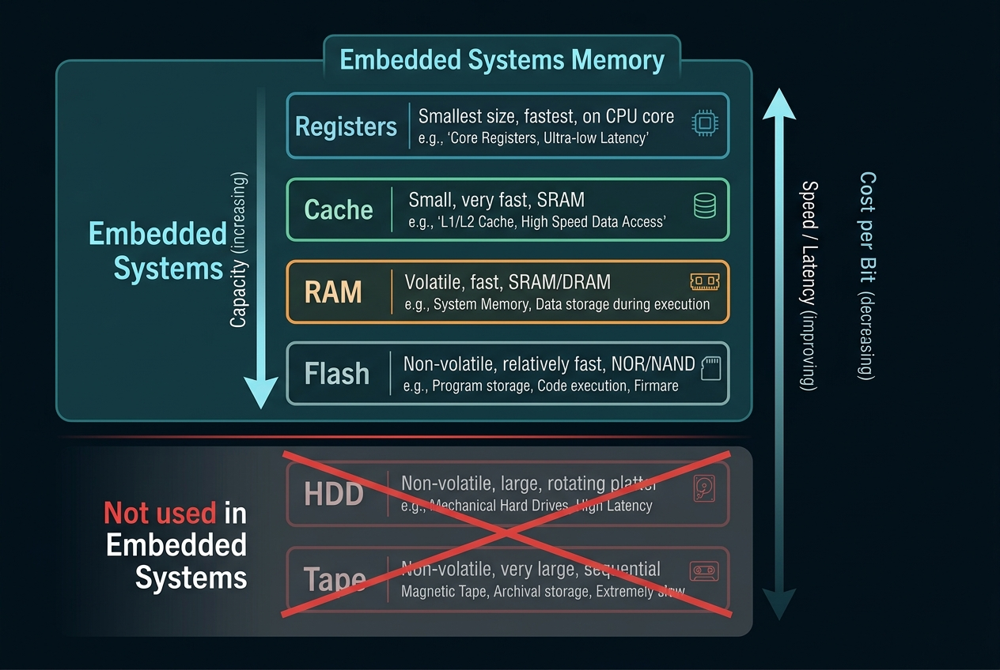

# Memory Management

## Memory Hierarchy Diagram

- **Embedded Systems Memory:** Register, Cache, RAM, Flash
- **Not Used in Embedded Systems:** HDD, Tape

---

## Key Considerations

When designing or selecting memory for embedded systems, we consider:
- **Capacity:** The amount of data/code the memory can store.
- **Power:** Energy consumption (critical for battery-powered devices).
- **Speed:** Access times and transfer rates.
- **Price:** Cost per unit, affecting overall bill of materials (BOM).

---

## Embedded Memory Types

### Registers
1. Inside the CPU
2. Store current operation data and addresses
3. Volatile

### Cache
1. Close to CPU
2. Store frequently accessed data
3. Volatile

### RAM
1. External
2. Stores temporary variables and stack
3. Volatile

### Flash
1. External
2. Stores firmware, bootloader and constants
3. Non-volatile

---

## Memory Characteristics

1. **Capacity:** The amount of storage a memory can hold (more capacity != more performance)
   - As we increase capacity, size, power and cost increase
2. **Volatility:** Whether it can store data without power
   - Volatile (Cant store without power): SRAM, DRAM, SDRAM, Register
   - Non-volatile: ROM/PROM/EPROM/EEPROM, Flash, Disk, Tape
   - Non-volatile storage often have limited write-erase cycles before failure
3. **Access**
   - Random Access Memory (RAM): SRAM, DRAM (Can access any part of memory if address is present)
   - Read-Only Memory (ROM): No ability to write
4. **Power Consumption**
5. **Latency:** Time it takes for memory to respond to read/write request
   - It is taken care using pipelines and caches
6. **Durability**
7. **Transaction Size**

---

## CPU Registers

- **General Purpose:** Store operation operands
- **Special Purpose:** Track and control CPU state

---

## Register Definition Files

Details on platform specific registers can be put in C source files called Register Definition Files.

---

## Linker File

Provides physical address to symbol mapping.

### Sub-segments

**Data** (`0x20000000` → `0x3FFFFFFF`):
- `data` — Initialised global/static variables
- `bss` — Uninitialised/zero-init global/static variables
- `heap` — Dynamic allocations
- `unused RAM`
- `stack` (`0x20010000`)
- `unused` (`0x3FFFFFFF`)

**Main / Flash** (`0x00000000` → `0x1FFFFFFF`):
- `invecs` (`0x00000000`) — Interrupt vectors
- `text` — Code
- `const` — Constants
- `cinit` — C runtime initialisation
- `pinit` — C++ constructors
- `unused flash` (`0x10040000`)
- `unused` (`0x1FFFFFFF`)

---

## Data Memory

- Stores our program's operands and program variables
- Data gets loaded into registers, and stored back into memory
- Data can be allocated at both compile time and runtime
- Data segment is a container for various types of allocated data

| Segment | Description |
|---------|-------------|
| **Stack** | Temporary data like local variables |
| **Heap** | Dynamic data storage |
| **Data** | Non-zero initialised global and static data |
| **BSS** | Zero initialised and uninitialised global and static data |

### Stack

1. Reserved at compile time, data allocated at runtime
2. Temporary data is stored and memory is reused throughout the program
3. Architecture dependent, usually used to track state of program
4. Typical implementations store routine specific data such as:
   - Local variables, input parameters and return data
   - May also include CPU state data: copy of used registers, return address, previous stack pointer and copy of special function registers
   - This data together is called a **stack frame**
5. It is **LIFO** (Last-In-First-Out Buffer)
6. It has push/pop operations
   - **Push:** Copies data from registers to stack
   - **Pop:** Removes data from stack to registers

### Heap

1. Reserved at compile time, data allocated at runtime by calling memory functions
2. Allocation size can vary with each call and also can be resized (dynamic)
3. Lifetime can be as long as the user chooses
4. Has `malloc()`, `calloc()`, `realloc()` and `free()`
   - `malloc()` and `calloc()` allocate heap space
   - `realloc()` resizes the heap space (can be an extension to old space or completely new space)
   - `free()` frees the heap space (deallocation)
   - When there is not enough contiguous space, these functions return a `NULL` pointer
5. Can have memory leaks and extra execution overhead

---

## Allocated Data Characteristics

1. **Size:** Specified in C
2. **Access**
3. **Scope:** How it can be used
   - Local: Only within the function its defined
   - Global: Can be used by the entire program
   - Dynamic Allocation: Can be used outside of local scope
4. **Location**
5. **Creation Time**
6. **Lifetime:** Function, Program, or longer than function but less than program (Dynamic Allocation)

---

## Code Memory

1. Runtime read-only non-volatile memory (Flash)
2. Write/erase requires extra credentials
3. Stores instructions and some data
4. Has latency and durability issues
5. Contains the following segments:
   - **Interrupt Vector Table** (`.intvecs`): Asynchronous events with an associated software routine
   - **Text** (`.text`): Actual compiled code
   - **Const** (`.const`): Read-only, constant data
   - **CINIT and PINIT** (`.cinit` and `.pinit`): Code used to initialise software or data
   - **Bootloader** (`.bootloader`): Small block of code installed in code memory that is run at startup
